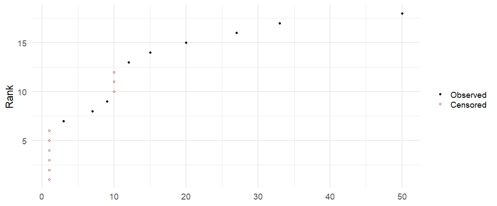
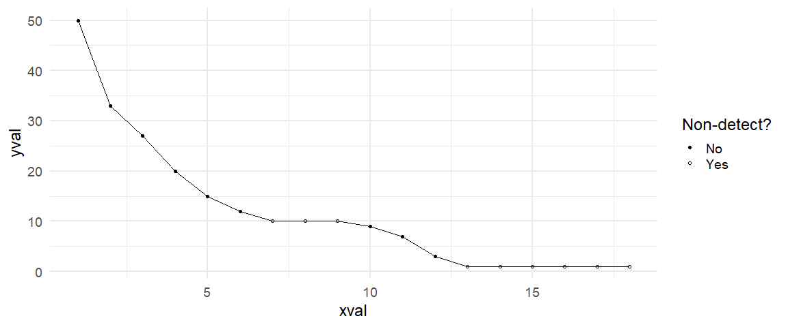

Nd
================

<!-- README.md is generated from README.Rmd. Please edit that file -->
<!-- badges: start -->
<!-- badges: end -->

The purpose of the `Nd` R package is to present an extension to the S3
class [`survival::Surv`](https://rdrr.io/cran/survival/man/Surv.html)
with a refocus on left-censored data, referred to as *non-detect* data,
that is commonly found in environmental statistics.

## Installation

This package is currently **not** on CRAN and can be installed from
[GitHub](https://github.com/) with:

``` r
# install.packages("devtools")
devtools::install_github("nclJoshCowley/Nd")
```

## Description

We can construct a `Nd` object using the supplied generic.

``` r
x <- Nd::Nd(c(1, 3, 7), is_nd = c(TRUE, FALSE, FALSE))
print(x)
#> [1] ND<1 3    7
```

``` r
x <- Nd::Nd(c("<1", "<1", "<1", "3.2", "7.5", "9.4", "<10", "<10", "12.1"))
print(x)
#> [1] ND<1  ND<1  ND<1  3.2   7.5   9.4   ND<10 ND<10 12.1
```

Printing the example shows several observations with conditional
formatting for left-censored data.

The underlying structure of this object is made up of a numerical
component, `value` and a logical component `is_nd`, both accessible via
the `$` operator.

``` r
x$value
#> [1]  1.0  1.0  1.0  3.2  7.5  9.4 10.0 10.0 12.1

x$is_nd
#> [1]  TRUE  TRUE  TRUE FALSE FALSE FALSE  TRUE  TRUE FALSE
```

Note the meaning of the numerical component is dependent on the logical
part:

- if `is_nd` is `TRUE`, the value represents the detection limit and the
  observation is said to be left-censored.

- otherwise, the value represents the measured concentration of the
  uncensored observation.

## Artificial Censor

An alternate method of creating left-censored data is to artificially
censor existing data. For example, we can censor the existing dataset at
some chosen quantile and see how the Nd objects appear in data frames.

``` r
data("mtcars", package = "datasets")
mtcars$mpg <- Nd::artificial_censor(mtcars$mpg, quantiles = 0.5)

utils::head(mtcars)
#>                       mpg cyl disp  hp drat    wt  qsec vs am gear carb
#> Mazda RX4              21   6  160 110 3.90 2.620 16.46  0  1    4    4
#> Mazda RX4 Wag          21   6  160 110 3.90 2.875 17.02  0  1    4    4
#> Datsun 710           22.8   4  108  93 3.85 2.320 18.61  1  1    4    1
#> Hornet 4 Drive       21.4   6  258 110 3.08 3.215 19.44  1  0    3    1
#> Hornet Sportabout ND<19.2   8  360 175 3.15 3.440 17.02  0  0    3    2
#> Valiant           ND<19.2   6  225 105 2.76 3.460 20.22  1  0    3    1
```

Alternatively, we could have censored at some known detection limit.

``` r
data("mtcars", package = "datasets")
mtcars$mpg <- Nd::artificial_censor(mtcars$mpg, detlims = 21)

utils::head(mtcars)
#>                     mpg cyl disp  hp drat    wt  qsec vs am gear carb
#> Mazda RX4         ND<21   6  160 110 3.90 2.620 16.46  0  1    4    4
#> Mazda RX4 Wag     ND<21   6  160 110 3.90 2.875 17.02  0  1    4    4
#> Datsun 710         22.8   4  108  93 3.85 2.320 18.61  1  1    4    1
#> Hornet 4 Drive     21.4   6  258 110 3.08 3.215 19.44  1  0    3    1
#> Hornet Sportabout ND<21   8  360 175 3.15 3.440 17.02  0  0    3    2
#> Valiant           ND<21   6  225 105 2.76 3.460 20.22  1  0    3    1
```

Multiple quantiles or detection limits are supported where values are
censored at the minimum detection limit they fall below.

``` r
data("mtcars", package = "datasets")
mtcars$mpg <- Nd::artificial_censor(mtcars$mpg, detlims = c(20, 21, 22))

utils::head(mtcars)
#>                     mpg cyl disp  hp drat    wt  qsec vs am gear carb
#> Mazda RX4         ND<21   6  160 110 3.90 2.620 16.46  0  1    4    4
#> Mazda RX4 Wag     ND<21   6  160 110 3.90 2.875 17.02  0  1    4    4
#> Datsun 710         22.8   4  108  93 3.85 2.320 18.61  1  1    4    1
#> Hornet 4 Drive    ND<22   6  258 110 3.08 3.215 19.44  1  0    3    1
#> Hornet Sportabout ND<20   8  360 175 3.15 3.440 17.02  0  0    3    2
#> Valiant           ND<20   6  225 105 2.76 3.460 20.22  1  0    3    1
```

There exists a helper function `cens_ratio`, that will allow us to
determine the ratio of observations that are left-censored (at any
detection limit).

``` r
Nd::cens_ratio(mtcars$mpg)
#> [1] 0.71875
```

## Imputation

Often, we want to use a method that only accepts numerical dependent
variables such as a linear model within `stats::lm`. Such approaches
have drawn criticism within the statistical community due to ad-hoc
nature of this method and its bias (George et al. 2021; D. R. Helsel
2011; Singh and Nocerino 2002)
<!-- (Singh & Nocerino, 2002; Helsel, 2011; George et al., 2021). -->

We can impute (replace `Nd` with `numeric`) using the `impute` generic
that accepts several imputation functions:

1.  `"DL2"`: replace `ND<1.0` with half the detection limit, `0.5`;

2.  `"ROS"`: regression on order statistics, see `?NADA::ros`;

3.  user supplied function of the form `f(value, is_nd, ...)` that
    returns a numeric of equal length.

Using our example,

``` r
impute(x, "DL2")
#> [1]  0.5  0.5  0.5  3.2  7.5  9.4  5.0  5.0 12.1

impute(x, "ROS")
#> Loading required namespace: NADA
#> [1]  1.575899  2.248943  2.918216  3.200000  7.500000  9.400000  2.690086
#> [8]  4.901998 12.100000

impute(x, function(value, is_nd) ifelse(is_nd, -1, value))
#> [1] -1.0 -1.0 -1.0  3.2  7.5  9.4 -1.0 -1.0 12.1
```

## Visualisation

Visualising a censored data is non-trivial since censored observations
represent a range of possible values instead of a single value. More
practical advice is given in D. Helsel, Hirsch, et al. (2020).

We supply the following methods for visualisation of data but these are
by no means complete and pull requests are welcome.

### Quantile Plot

Since it is possible to order censored data, we can plot the rank of
each observation against the value (concentration or detection limit).
Such a plot highlights the extreme points of the data and the detection
limit structure.

``` r
ggplot2::autoplot(Nd_example, type = "quantile") +
  ggplot2::labs("Quantile Plot")
```



### Time-Series Plot

Ideally this would be a `ggproto` object but this is in development.

Instead, the following object will add multiple layers comprised of
`ggplot2::geom_point` and `ggplot2::geom_line` which is most useful when
the `x` variable is time. Note, using the detection limits as plotting
points may be misleading (D. Helsel, Hirsch, et al. 2020).

``` r
plot_data <- tibble::enframe(rev(Nd_example), name = "xval", value = "yval")

ggplot2::ggplot(plot_data, ggplot2::aes(x = .data$xval, y = .data$yval)) +
  layer_Nd_line(.data$yval)
```



## References

<div id="refs" class="references csl-bib-body hanging-indent">

<div id="ref-george2021censoring" class="csl-entry">

George, Barbara Jane et al. 2021. “Censoring Trace-Level Environmental
Data: Statistical Analysis Considerations to Limit Bias.” *Environmental
Science & Technology* 55 (6): 3786–95.

</div>

<div id="ref-helsel2011statistics" class="csl-entry">

Helsel, Dennis R. 2011. *Statistics for Censored Environmental Data
Using Minitab and r*. 2nd ed. John Wiley & Sons.

</div>

<div id="ref-usgs2020" class="csl-entry">

Helsel, Dennis, Robert Hirsch, et al. 2020. “<span
class="nocase">Statistical methods in water resources: U.S. Geological
Survey Techniques and Methods, book 4, chap. A3</span>.” U.S. Geological
Survey. <https://doi.org/10.3133/tm4a3>.

</div>

<div id="ref-singh2002robust" class="csl-entry">

Singh, Anita, and John Nocerino. 2002. “Robust Estimation of Mean and
Variance Using Environmental Data Sets with Below Detection Limit
Observations.” *Chemometrics and Intelligent Laboratory Systems* 60
(1-2): 69–86.

</div>

</div>
